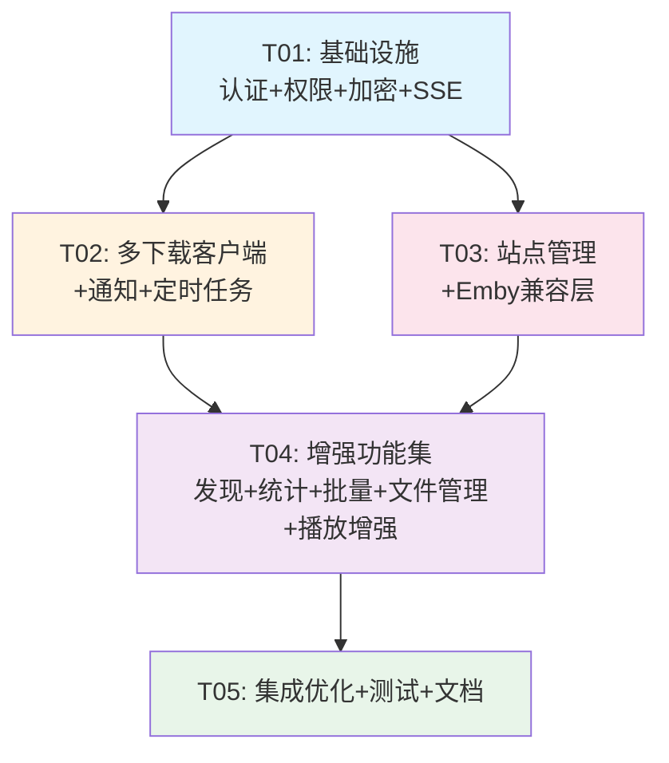

# MediaStationGo 重构架构设计方案

> **版本**: v1.0 | **日期**: 2026-02-04 | **作者**: Architect (Bob)
>
> 本文档基于旧版 Python 实现（~220 API）与当前 Go 版实现（~50+ API）的差距分析，
> 设计完整的重构架构方案，涵盖数据模型、文件结构、依赖、任务分解和跨模块约定。

---

## 一、差距总览

| 维度 | 原版 (Python) | 当前 Go 版 | 差距 | 优先级 |
|------|---------------|-----------|------|--------|
| **API 端点总数** | ~220 | ~50+ | **~170 个缺失** | - |
| **认证** | access_token + refresh_token | 单一 JWT(24h) | 缺 Token 刷新 + 细粒度权限 | P0 |
| **用户系统** | 19 项细粒度权限 | admin/user 两角色 | 缺完整 RBAC | P0 |
| **Emby 兼容层** | ~50 端点 | 无 | **完全缺失** | P0 |
| **站点管理** | 6 种 PT 站类型 + 聚合搜索 | 仅 RSS 订阅 | 完全缺失站点抽象层 | P0 |
| **通知渠道** | Telegram/微信/Bark/Webhook/Email | 无 | **完全缺失** | P0 |
| **下载客户端** | qBittorrent + Transmission + Aria2 | 仅 qBittorrent | 缺 2 个适配器 | P0 |
| **统计端点** | 8 个 | 1 个 (/api/stats) | 缺趋势/热门/监控等 | P1 |
| **批量操作** | 8 个 | 无 | **完全缺失** | P1 |
| **文件管理器** | 浏览/移动/复制/删除/重命名 | 无 | **完全缺失** | P1 |
| **API 配置管理** | 9 端点 + 加密存储 | 散落在 Config/Setting | 需统一 ApiConfig 表 | P1 |
| **发现页** | 12 个推荐区块 | 2 个 (trending + popular) | 缺 10 个区块 | P1 |
| **DLNA 投屏** | stub (3 端点) | 无 | 可延后 | P2 |
| **授权/Plus** | 13 端点 | 无 | 可延后 | P2 |

---

## 二、新增/修改的数据模型

### 2.1 新增模型定义

```go
// ═══════════════════════════════════════════
//  1. 用户权限模型 (替代 admin/user 二元角色)
// ═══════════════════════════════════════════

// UserPermission stores 19 fine-grained permission flags per user.
// Admin users implicitly have all permissions; Plus tier users too.
type UserPermission struct {
    ID     string `gorm:"primaryKey;size:36)" json:"id"`
    UserID string `gorm:"uniqueIndex;size:36;not null" json:"user_id"`

    // Default-on permissions (granted to new users)
    CanViewDashboard   bool `gorm:"default:true" json:"can_view_dashboard"`
    CanPlayMedia       bool `gorm:"default:true" json:"can_play_media"`
    CanCast            bool `gorm:"default:true" json:"can_cast"`
    CanExternalPlayer  bool `gorm:"default:true" json:"can_external_player"`
    CanFavorite        bool `gorm:"default:true" json:"can_favorite"`
    CanViewHistory     bool `gorm:"default:true" json:"can_view_history"`

    // Restricted permissions (admin-only by default)
    CanEditMedia       bool `gorm:"default:false" json:"can_edit_media"`
    CanRescrape        bool `gorm:"default:false" json:"can_rescrape"`
    CanUseAI           bool `gorm:"default:false" json:"can_use_ai"`
    CanCaptureFrames   bool `gorm:"default:false" json:"can_capture_frames"`
    CanManageDownloads  bool `gorm:"default:false" json:"can_manage_downloads"`
    CanViewDiscover    bool `gorm:"default:false" json:"can_view_discover"`
    CanManageSubscriptions bool `gorm:"default:false" json:"can_manage_subscriptions"`
    CanManageSites      bool `gorm:"default:false" json:"can_manage_sites"`
    CanUseAIAssistant   bool `gorm:"default:false" json:"can_use_ai_assistant"`
    CanManageUsers      bool `gorm:"default:false" json:"can_manage_users"`
    CanManageFiles      bool `gorm:"default:false" json:"can_manage_files"`
    CanManageStrm       bool `gorm:"default:false" json:"can_manage_strm"`
    CanAccessSettings   bool `gorm:"default:false" json:"can_access_settings"`

    CreatedAt time.Time `json:"created_at"`
    UpdatedAt time.Time `json:"updated_at"`
}
```

```go
// ═══════════════════════════════════════════
//  2. Refresh Token 模型
// ═══════════════════════════════════════════

// RefreshToken stores long-lived refresh tokens for token rotation.
type RefreshToken struct {
    ID        string    `gorm:"primaryKey;size:36)" json:"id"`
    UserID    string    `gorm:"index;size:36;not null" json:"user_id"`
    TokenHash string    `gorm:"uniqueIndex;size:128;not null" json:"-"`
    ExpiresAt time.Time `gorm:"index" json:"expires_at"`
    CreatedAt time.Time `json:"created_at"`
    Revoked   bool      `gorm:"default:false" json:"revoked"`
}
```

```go
// ═══════════════════════════════════════════
//  3. 下载客户端模型 (多客户端支持)
// ═══════════════════════════════════════════

// DownloadClient represents a configured download client (qBittorrent / Transmission / Aria2).
type DownloadClient struct {
    Base
    Name     string `gorm:"size:128;not null" json:"name"`
    Type     string `gorm:"size:32;not null" json:"type"`         // qbittorrent / transmission / aria2
    Host     string `gorm:"size:512;not null" json:"host"`         // http://host:port
    Port     int    `json:"port"`                                  // 0 = included in host
    Username string `gorm:"size:255" json:"username,omitempty"`
    Password string `gorm:"size:255" json:"-"`                     // stored encrypted or plain
    Enabled  bool   `gorm:"default:true" json:"enabled"`
    Category string `gorm:"size:255" json:"category,omitempty"`   // default save category
}

// DownloadTask — MODIFY existing: add ClientID, InfoHash, and more fields.
// New fields to ADD to existing model:
//   ClientID    string  `gorm:"size:36" json:"client_id"`           // FK -> DownloadClient.ID
//   InfoHash    string  `gorm:"size:64;index" json:"info_hash,omitempty"`
//   TotalSize   int64   `json:"total_size,omitempty"`
//   Progress    float32 `json:"progress"`                           // 0.0-1.0
//   SpeedDown   int64   `json:"speed_down,omitempty"`               // bytes/sec
//   SpeedUp     int64   `json:"speed_up,omitempty"`                 // bytes/sec
//   Message     string  `gorm:"size:512" json:"message,omitempty"`
```

```go
// ═══════════════════════════════════════════
//  4. 站点管理模型 (PT 站 / RSS)
// ═══════════════════════════════════════════

// Site represents a PT site or custom RSS source configuration.
type Site struct {
    Base
    Name        string `gorm:"size:128;not null" json:"name"`
    BaseURL     string `gorm:"size:1024" json:"base_url"`
    SiteType    string `gorm:"size:32;not null" json:"site_type"`   // nexusphp / gazelle / unit3d / mteam / discuz / custom_rss
    AuthType    string `gorm:"size:16;not null" json:"auth_type"`   // cookie / api_key / auth_header
    Cookie      string `gorm:"type:text" json:"-"`                  // encrypted at rest
    APIKey      string `gorm:"size:512" json:"-"`                   // encrypted at rest
    AuthHeader  string `gorm:"size:1024" json:"-"`                  // encrypted at rest
    UserAgent   string `gorm:"size:512" json:"user_agent,omitempty"`
    RSSURL      string `gorm:"size:2048" json:"rss_url,omitempty"`
    TimeoutSec  int    `gorm:"default:30" json:"timeout_sec"`
    Priority    int    `gorm:"default:0" json:"priority"`
    UseProxy    bool   `gorm:"default:false" json:"use_proxy"`
    RateLimit   int    `gorm:"default:0" json:"rate_limit"`          // 0 = unlimited
    Enabled     bool   `gorm:"default:true" json:"enabled"`

    // Runtime status (not persisted to DB on every request, updated by poller)
    LoginStatus  *string `gorm:"size:32" json:"login_status,omitempty"` // ok / failed / untested
    UploadBytes  int64   `json:"upload_bytes,omitempty"`
    DownloadBytes int64  `json:"download_bytes,omitempty"`
}
```

```go
// ═══════════════════════════════════════════
//  5. 通知渠道模型
// ═══════════════════════════════════════════

// NotifyChannel represents a notification delivery channel.
type NotifyChannel struct {
    Base
    Name        string `gorm:"size:128;not null" json:"name"`
    ChannelType string `gorm:"size:32;not null" json:"channel_type"`  // telegram / wechat_bark / webhook / email
    Enabled     bool   `gorm:"default:true" json:"enabled"`

    // Type-specific config stored as JSON blob
    // Telegram:  { "bot_token": "...", "chat_id": "..." }
    // WeChat:    { "sendkey": "..." }
    // Bark:      { "server": "...", "key": "..." }
    // Webhook:   { "url": "...", "method": "POST", "headers": {} }
    // Email:     { "smtp_host", "smtp_port", "username", "password", "to_address", "from_name" }
    Config  string `gorm:"type:text" json:"config,omitempty"`
    EncryptedConfig string `gorm:"type:text" json:"-"`                // encrypted sensitive fields

    // Which events trigger this channel (comma-separated or JSON array)
    Events string `gorm:"type:text" json:"events"` // subscription_hit, download_complete, scrape_failed, system_alert
}
```

```go
// ═══════════════════════════════════════════
//  6. API 配置管理模型 (统一 Provider Key 管理)
// ═══════════════════════════════════════════

// ApiConfig stores external API credentials with optional encryption.
type ApiConfig struct {
    ID     string `gorm:"primaryKey;size:36)" json:"id"`
    Provider string `gorm:"size:64;uniqueIndex;not null" json:"provider"` // tmdb / douban / bangumi / thetvdb / fanart / openai / deepseek / siliconflow / adult
    APIKey   string `gorm:"size:512" json:"-"`                              // encrypted
    BaseURL  string `gorm:"size:512" json:"base_url,omitempty"`
    Extra    string `gorm:"type:text" json:"extra,omitempty"`             // provider-specific extra config (JSON)
    Enabled  bool   `gorm:"default:true" json:"enabled"`
    Description string `gorm:"size:255" json:"description,omitempty"`
    LastTestedAt *time.Time `json:"last_tested_at,omitempty"`
    TestResult   string `gorm:"size:32" json:"test_result,omitempty"`    // success / failure / untested
    UpdatedAt    time.Time `json:"updated_at"`
}
```

```go
// ═══════════════════════════════════════════
//  7. STRM 文件模型 (外部存储支持)
// ═══════════════════════════════════════════

// STRMRecord maps a Media item to an external storage URL.
// When Media.Path is a .strm file, its content is read as the real URL.
type STRMRecord struct {
    Base
    MediaID string `gorm:"uniqueIndex;size:36;not null" json:"media_id"`
    URL     string `gorm:"size:2048;not null" json:"url"`            // actual remote URL
    Protocol string `gorm:"size:32" json:"protocol"`                    // webdav / alist / s3 / http / https
}
```

```go
// ═══════════════════════════════════════════
//  8. 增强订阅模型 (扩展现有 Subscription)
// ═══════════════════════════════════════════
// Add to existing Subscription:
//   TMDbID      int     `json:"tmdb_id,omitempty"`              // link to scraped media
//   MediaType   string  `gorm:"size:32" json:"media_type,omitempty"`  // movie / tv / anime
//   Year        int     `json:"year,omitempty"`
//   QualityFilter []byte `json:"quality_filter,omitempty"`          // ordered priority list (JSON)
//   MinSizeMB   int     `json:"min_size_mb,omitempty"`
//   MaxSizeMB   int     `json:"max_size_mb,omitempty"`
//   ExcludeKeys string  `gorm:"size:1024" json:"exclude_keywords,omitempty"`
//   IncludeKeys string  `gorm:"size:1024" json:"include_keywords,omitempty"`
//   TotalDownloaded int `json:"total_downloaded,omitempty"`
//   Status      string  `gorm:"size:32;default:active" json:"status"`  // active / paused / disabled
```

```go
// ═══════════════════════════════════════════
//  9. 字幕模型 (独立实体，从 Media 中分离)
// ═══════════════════════════════════════════

// SubtitleTrack represents a subtitle file associated with media.
type SubtitleTrack struct {
    Base
    MediaID    string `gorm:"index;size:36;not null" json:"media_id"`
    Language   string `gorm:"size:16" json:"language"`              // zh / en / und
    LanguageName string `gorm:"size:128" json:"language_name,omitempty"`
    Path       string `gorm:"size:1024;not null" json:"path"`
    Source     string `gorm:"size:32" json:"source"`                // external / embedded / uploaded
    Codec      string `gorm:"size:16" json:"codec"`                 // srt / ass / vtt / ssa
    IsInternal bool   `gorm:"default:false" json:"is_internal"`    // embedded in container
    StreamIdx  int    `json:"stream_idx,omitempty"`                 // for embedded subs
}
```

### 2.2 需修改的现有模型

| 模型 | 修改内容 |
|------|----------|
| **User** | 新增字段：`Tier` (free/plus), `Nickname`, `IsActive`, `AvatarURL`(保留), `LastLoginAt`(保留) |
| **Media** | 新增字段：`DoubanID`, `FileHash`(SHA256), `IsDuplicate`, `DuplicateOfID`, `STRMURL`, `Resolution`, `AudioChannels`, `HdrFormat`, `FrameRate`, `ColorSpace`, `BitDepth`, `Genres`(JSON) |
| **Library** | 新增字段：`ScanIntervalMin`, `MetadataLanguage`, `AdultContent`, `PreferNFO`, `EnableWatch`, `MinFileSizeMB` |
| **Playlist** | 新增字段：`Description`, `CoverURL` |
| **PlaybackHistory** | 新增字段：`DeviceType`, `IPAddress`, `PlayedAt`(保留 WatchedAt) |

---

## 三、新增/修改的文件清单（完整路径）

### 3.1 后端新增文件

```
internal/
├── model/
│   ├── permission.go              # UserPermission model
│   ├── refresh_token.go            # RefreshToken model
│   ├── download_client.go         # DownloadClient model
│   ├── site.go                    # Site model (PT sites)
│   ├── notify_channel.go          # NotifyChannel model
│   ├── api_config.go              # ApiConfig model
│   ├── strm.go                    # STRMRecord model
│   └── subtitle_track.go          # SubtitleTrack model
│
├── repository/
│   ├── permission_repo.go         # UserPermission CRUD
│   ├── refresh_token_repo.go      # RefreshToken CRUD
│   ├── download_client_repo.go    # DownloadClient CRUD
│   ├── site_repo.go               # Site CRUD
│   ├── notify_channel_repo.go     # NotifyChannel CRUD
│   ├── api_config_repo.go         # ApiConfig CRUD
│   ├── strm_repo.go               # STRMRecord CRUD
│   └── subtitle_track_repo.go     # SubtitleTrack CRUD
│
├── middleware/
│   ├── permission.go              # RequirePermission(permissionKey) middleware
│   └── emby_auth.go               # Emby auth (X-Emby-Token / Bearer / username+password)
│
├── service/
│   ├── permission_svc.go          # Permission business logic (defaults, checks, grant/revoke)
│   ├── token_svc.go               # JWT pair issuance, refresh rotation, revocation
│   ├── download_adapter.go        # DownloadClient adapter interface + registry
│   ├── qbittorrent_adp.go         # qBittorrent adapter (refactor from qbittorrent.go)
│   ├── transmission_adp.go        # Transmission RPC adapter [NEW]
│   ├── aria2_adp.go               # Aria2 JSON-RPC adapter [NEW]
│   ├── download_manager_svc.go    # Multi-client orchestration (dispatch by client_type)
│   ├── site_svc.go                # Site CRUD + test connection + browse resources
│   ├── site_adapter.go            # SiteAdapter interface + NexusPHP/Gazelle/UNIT3D/MTeam/Discuz adapters
│   ├── site_search_svc.go         # Cross-site aggregated search
│   ├── notify_svc.go              # Notification dispatch engine (event → channels)
│   ├── notify_telegram.go         # Telegram sender
│   ├── notify_wechat.go           # Server酱 (WeChat) sender
│   ├── notify_bark.go             # Bark sender
│   ├── notify_webhook.go          # Webhook sender
│   ├── notify_email.go            # Email (SMTP) sender
│   ├── api_config_svc.go          # ApiConfig CRUD + encryption + test connection
│   ├── crypto_svc.go              # AES-128-CBC encrypt/decrypt for sensitive data
│   ├── strm_svc.go                # STRM file management + protocol whitelist
│   ├── emby_handler_svc.go        # Emby API handler (~50 endpoints)
│   ├── douban_scraper.go          # Douban metadata provider [NEW]
│   ├── discover_feed_svc.go       # Multi-source discovery feed (12 sections)
│   ├── batch_svc.go               # Batch operations (scan/scrape/delete/move/favorite/watched/rename/ai-rename)
│   ├── filemanager_svc.go         # File browser + move/copy/delete/mkdir/rename
│   ├── duplicate_svc.go           # File hash-based duplicate detection
│   ├── stats_enhanced_svc.go      # Trend/top-content/top-users/monitor/user-stats
│   ├── sse_hub.go                 # SSE (Server-Sent Events) event stream hub
│   ├── external_player_svc.go     # External player protocol URLs (8 players)
│   ├── thumbnail_svc.go           # FFmpeg video frame capture (thumbnail)
│   ├── scheduler_svc.go           # Cron-based task scheduler (robfig/cron)
│   └── backup_svc.go              # System backup/restore
│
├── handler/
│   ├── permission_handler.go      # GET/PUT user permissions, POST reset
│   ├── refresh_handler.go         # POST /api/auth/refresh
│   ├── download_client_handler.go # CRUD + test for download clients
│   ├── site_handler.go            # Site CRUD + test + browse + userdata
│   ├── site_search_handler.go     # GET /api/search/sites (cross-site search)
│   ├── notify_handler.go          # NotifyChannel CRUD + test
│   ├── api_config_handler.go      # ApiConfig CRUD + test + providers list
│   ├── strm_handler.go            # STRM config + media-level STRM URL management
│   ├── emby_router.go             # All Emby-compatible routes (~50 routes)
│   ├── douban_search_handler.go  # GET /api/search/douban
│   ├── discover_feed_handler.go  # GET /api/discover/feed, GET /api/discover/sections
│   ├── batch_handler.go           # 8 batch operation endpoints
│   ├── filemanager_handler.go     # File browser + operations
│   ├── duplicate_handler.go      # Hash compute + scan + list + unmark
│   ├── stats_enhanced_handler.go # 7 new stats endpoints
│   ├── sse_handler.go             # GET /api/system/events (SSE stream)
│   ├── external_player_handler.go# External URLs + protocols
│   ├── thumbnail_handler.go       # GET /api/media/:id/thumbnail
│   ├── subtitle_enhanced_handler.go  # Upload/scan/extract/manage subtitles
│   ├── scheduler_handler.go      # Scheduler management
│   └── backup_handler.go          # Backup/restore
│
└── emby_types.go                  # Emby-specific DTOs (User, Item, Session, etc.)
```

### 3.2 后端需修改的文件

| 文件 | 修改内容 |
|------|----------|
| `model/model.go` | 添加新模型引用到 AllModels()；修改 User/Media/Library/Playlist/PlaybackHistory 结构体 |
| `repository/repository.go` | Container 添加新 Repository 字段 |
| `middleware/middleware.go` | 添加 RequirePermission 构造函数 |
| `service/service.go` | Container 添加新 Service 字段；Boot() 启动新后台服务 |
| `service/auth.go` | 支持 Tier 字段；签发 access_token + refresh_token 对；集成权限检查 |
| `handler/handler.go` | Register() 注册所有新路由分组 |
| `config/config.go` | 新增通知配置段、DLNA 配置段、调度器配置段 |
| `cmd/server/main.go` | 初始化新服务 |

### 3.3 前端新增文件

```
web/src/
├── pages/
│   ├── SitesPage.tsx               # 站点管理页面
│   ├── SiteSearchPage.tsx          # 跨站资源搜索页面
│   ├── FileManagerPage.tsx          # 文件管理器页面
│   ├── SettingsPage.tsx             # 系统设置页面（多 Tab）
│   │   # 内含子组件：
│   │   ├── components/settings/
│   │   │   ├── GeneralTab.tsx       # 通用设置 Tab
│   │   │   ├── AccountTab.tsx       # 账户设置 Tab
│   │   │   ├── UsersTab.tsx         # 用户管理 Tab
│   │   │   ├── LibrariesTab.tsx     # 媒体库设置 Tab
│   │   │   ├── ScrapeOrganizeTab.tsx# 整理与刮削设置 Tab
│   │   │   ├── DownloadTab.tsx      # 下载客户端设置 Tab
│   │   │   ├── NotifyTab.tsx        # 通知渠道设置 Tab
│   │   │   ├── SchedulerTab.tsx     # 定时任务设置 Tab
│   │   │   ├── SystemTab.tsx        # 系统设置 Tab
│   │   │   ├── ApiConfigTab.tsx     # API 配置 Tab
│   │   │   ├── LicenseTab.tsx       # 授权管理 Tab
│   │   │   └── AdultTab.tsx         # Adult Provider 设置 Tab
│   │   ├── ConfigGroup.tsx          # 配置表单通用组件
│   │   └── ConfigRow.tsx            # 配置行组件
│   ├── StatsEnhancedPage.tsx        # 增强统计仪表盘
│   ├── StrmPage.tsx                # STRM 文件管理页面
│   ├── HistoryPage.tsx              # 观看历史页面
│   ├── DlnaPage.tsx                # DLNA 投屏页面
│   ├── AiAssistantPage.tsx          # AI 助手对话页面
│   ├── PosterWallPage.tsx           # 海报墙视图
│   └── LicensePage.tsx              # 授权管理页面
│
├── api/
│   ├── permission.ts               # 权限 API (get/update/reset)
│   ├── refresh.ts                  # Token 刷新 API
│   ├── downloadClient.ts           # 下载客户端 API
│   ├── site.ts                     # 站点 API
│   ├── siteSearch.ts               # 跨站搜索 API
│   ├── notify.ts                   # 通知渠道 API
│   ├── apiConfig.ts                # API 配置管理 API
│   ├── strm.ts                     # STRM API
│   ├── douban.ts                   # 豆瓣搜索 API
│   ├── discoverFeed.ts             # 发现聚合 API (多源 feed)
│   ├── batch.ts                    # 批量操作 API
│   ├── filemanager.ts              # 文件管理器 API
│   ├── duplicate.ts                # 重复检测 API
│   ├── statsEnhanced.ts            # 增强统计 API
│   ├── sse.ts                      # SSE 连接工具
│   ├── externalPlayer.ts           # 外部播放器 API
│   ├── thumbnail.ts                # 截图 API
│   ├── subtitleEnhanced.ts         # 增强字幕 API (上传/提取/删除)
│   ├── scheduler.ts                # 定时任务 API
│   ├── backup.ts                   # 备份/恢复 API
│   ├── license.ts                  # 授权 API
│   └── dlna.ts                     # DLNA API
│
├── stores/
│   ├── permissions.ts              # 权限状态 store (Zustand)
│   ├── settings.ts                 # 系统设置 store (Zustand)
│   ├── notifications.ts            # 通知消息 store (Zustand)
│   └── sse.ts                      # SSE 连接 store (Zustand)
│
├── hooks/
│   ├── usePermission.ts            # usePermission(key) hook
│   ├── useSSE.ts                   # SSE 事件流 hook
│   └── useExternalPlayer.ts        # 外部播放器协议生成 hook
│
├── components/
│   ├── settings/                   # 设置页子组件目录
│   ├── FileTree.tsx                # 文件树组件
│   ├── FileTreeNode.tsx            # 文件树节点组件
│   ├── PermissionGuard.tsx         # 权限守卫组件 (<PermissionGuard permission="can_play_media">)
│   ├── DiscoverSection.tsx         # 发现页区块组件
│   ├── SiteCard.tsx                # 站点卡片组件
│   ├── DownloadClientCard.tsx      # 下载客户端卡片组件
│   ├── NotifyChannelCard.tsx       # 通知渠道卡片组件
│   ├── ApiConfigCard.tsx           # API 配置卡片组件
│   ├── BatchOperationBar.tsx       # 批量操作栏组件
│   ├── PlayerProtocolList.tsx      # 播放器协议列表组件
│   ├── StatsChart.tsx              # 统计图表组件
│   └── AppEmpty.tsx                # 空状态占位组件
│
└── types/
    └── index.ts                    # 扩展: 添加新类型定义
```

### 3.4 前端需修改的文件

| 文件 | 修改内容 |
|------|----------|
| `App.tsx` | 新增 ~15 个路由 (Sites/FileManager/Settings/StatsEnhanced/Strm/History/DLNA/AiAssistant/PosterWall/License)；添加 `<PermissionGuard>` 路由级守卫 |
| `stores/auth.ts` | 新增 permissions 对象、tokenRefresh() 方法、tier 字段 |
| `components/RequireAuth.tsx` | 集成权限检查逻辑 |
| `components/Layout.tsx` | 侧边栏新增菜单项（站点管理/文件管理/STRM/DLNA/统计/设置） |
| `types/index.ts` | 新增所有新模型的 TypeScript 类型 |

---

## 四、依赖包列表

### 4.1 Go 新增依赖

```
# 已有依赖保持不变，新增：

github.com/robfig/cron/v3        v3.0.1     # 定时任务调度器 (APScheduler 替代)
golang.org/x/crypto/v0          latest     # crypto/aes (AES-128-CBC 加密)
github.com/go-resty/resty/v3     v3.10.0    # HTTP client (Transmission/Aria2/Site 调用)
github.com/gabriel-vasile/mimetype v1.4.2    # MIME 类型检测 (字幕格式识别)
github.com/disintegration/imaging v4.0.0  # 图片处理 (缩略图截取/缩放)
```

### 4.2 npm 新增依赖

```
# 已有依赖保持不变，新增：

@mui/icons-material ^5.14.0      # Material Design 图标库（设置页需要大量图标）
recharts ^2.5.0                   # React 图表库（统计图表）
react-virtuoso ^4.6.0             # 虚拟滚动（大列表性能）
dayjs ^1.11.10                   # 轻量日期库（替代 moment.js）
framer-motion ^11.0.0            # 动画库（发现页过渡动画）
```

---

## 五、任务分解（按实现顺序）

### T01: 项目基础设施增强（认证+权限+加密+SSE 核心）

**优先级**: P0 | **依赖**: 无 | **预估代码量**: ~2000 行

| 类别 | 文件 |
|------|------|
| **新模型** | `model/permission.go`, `model/refresh_token.go`, `model/api_config.go` |
| **Repository** | `permission_repo.go`, `refresh_token_repo.go`, `api_config_repo.go` |
| **Service** | `service/permission_svc.go`, `service/token_svc.go`, `service/crypto_svc.go`, `service/sse_hub.go` |
| **Middleware** | `middleware/permission.go` |
| **Handler** | `handler/permission_handler.go`, `handler/refresh_handler.go`, `handler/api_config_handler.go` |
| **Handler (mod)** | `handler/handler.go` (注册新路由) |
| **Service (mod)** | `service/auth.go` (支持 token 对 + tier), `service/service.go` (Container 扩展) |
| **Model (mod)** | `model/model.go` (AllModels 扩展, User 字段扩展) |
| **前端** | `stores/auth.ts` (permissions + refresh), `stores/sse.ts`, `stores/permissions.ts`, `hooks/usePermission.ts`, `hooks/useSSE.ts`, `components/PermissionGuard.tsx`, `types/index.ts` (扩展), `api/permission.ts`, `api/refresh.ts`, `api/apiConfig.ts` |

**核心交付物**:
- 19 项细粒度权限系统的完整链路（模型→仓库→中间件→服务→Handler→前端守卫）
- Access Token (60min) + Refresh Token (30天) 双令牌机制
- AES-128-CBC 加密服务（敏感数据加解密，兼容明文迁移）
- SSE 事件流 Hub（替代 WebSocket 的备选实时通道）
- ApiConfig 表 + 9 个管理端点（统一 API Key 管理 + 加密存储 + 测试连接）

---

### T02: 多下载客户端 + 通知渠道 + 定时任务

**优先级**: P0 | **依赖**: T01（加密服务用于密码加密） | **预估代码量**: ~3000 行

| 类别 | 文件 |
|------|------|
| **新模型** | `model/download_client.go` |
| **Repository** | `download_client_repo.go`, `notify_channel_repo.go` |
| **Service** | `service/download_adapter.go` (接口), `service/qbittorrent_adp.go` (重构), `service/transmission_adp.go`, `service/aria2_adp.go`, `service/download_manager_svc.go`, `service/notify_svc.go`, `service/notify_telegram.go`, `service/notify_wechat.go`, `service/notify_bark.go`, `service/notify_webhook.go`, `service/notify_email.go`, `service/scheduler_svc.go` |
| **Handler** | `handler/download_client_handler.go`, `handler/notify_handler.go`, `handler/scheduler_handler.go` |
| **Handler (mod)** | `handler/handler.go`, `handler/downloads.go` (改为通过 DownloadManager) |
| **Service (mod)** | `service/downloads.go` (重构为多客户端分发), `service/service.go` (Boot 启动 scheduler + notifier) |
| **前端** | `api/downloadClient.ts`, `api/notify.ts`, `api/scheduler.ts`, `components/DownloadClientCard.tsx`, `components/NotifyChannelCard.tsx` |

**核心交付物**:
- DownloadClient 适配器模式（Interface + qBittorrent/Transmission/Aria2 三实现）
- 5 种通知渠道（Telegram/Server酱/Bark/Webhook/Email）完整发送链路
- 事件驱动通知引擎（subscription_hit / download_complete / scrape_failed / system_alert）
- 基于 robfig/cron 的定时任务调度器（替代 APScheduler），内置 6 个预配置任务
- 下载客户端热插拔（运行时添加/移除/测试连接）

---

### T03: 站点管理 + Emby API 兼容层

**优先级**: P0 | **依赖**: T01（加密服务用于 Cookie/APIKey 存储） | **预估代码量**: ~4000 行

| 类别 | 文件 |
|------|------|
| **新模型** | `model/site.go` |
| **Repository** | `site_repo.go` |
| **Service** | `service/site_svc.go`, `service/site_adapter.go` (接口+6种适配器), `service/site_search_svc.go`, `service/emby_handler_svc.go`, `service/strm_svc.go` |
| **Model** | `model/strm.go`, `emby_types.go` |
| **Handler** | `handler/site_handler.go`, `handler/site_search_handler.go`, `handler/emby_router.go` (~50 路由), `handler/strm_handler.go` |
| **Middleware** | `middleware/emby_auth.go` |
| **前端** | `api/site.ts`, `api/siteSearch.ts`, `api/strm.ts`, `pages/SitesPage.tsx`, `pages/SiteSearchPage.tsx`, `pages/StrmPage.tsx`, `components/SiteCard.tsx` |

**核心交付物**:
- 6 种 PT 站点类型适配器（NexusPHP / Gazelle / UNIT3D / MTeam / Discuz / Custom RSS）
- 3 种认证方式（Cookie / API Key / Authorization Header），全部加密存储
- 跨站聚合搜索（并发搜索多个站点，合并去重排序）
- 站点资源浏览器（分页浏览种子列表）
- **Emby API 兼容层**（~50 端点）：认证 → 系统信息 → 媒体库 → Items → PlaybackInfo → 流代理 → 字幕 → 进度上报
- STRM 文件管理（外部存储以"文件"形式入库，WebDAV/Alist/S3/HTTP 协议白名单校验）
- Emby 认证中间件（X-Emby-Token / Bearer / Username+Password 三种方式）

---

### T04: 增强功能集（发现页+统计+批量操作+文件管理+播放增强+刮削增强）

**优先级**: P1 | **依赖**: T01, T02, T03 | **预估代码量**: ~3500 行

| 类别 | 文件 |
|------|------|
| **Service** | `service/discover_feed_svc.go` (12 区块), `service/stats_enhanced_svc.go`, `service/batch_svc.go`, `service/filemanager_svc.go`, `service/duplicate_svc.go`, `service/douban_scraper.go`, `service/external_player_svc.go`, `service/thumbnail_svc.go`, `service/backup_svc.go` |
| **Model** | `model/subtitle_track.go` |
| **Repository** | `subtitle_track_repo.go`, `strm_repo.go` |
| **Handler** | `handler/discover_feed_handler.go`, `handler/stats_enhanced_handler.go`, `handler/batch_handler.go`, `handler/filemanager_handler.go`, `handler/duplicate_handler.go`, `handler/douban_search_handler.go`, `handler/external_player_handler.go`, `handler/thumbnail_handler.go`, `handler/subtitle_enhanced_handler.go`, `handler/backup_handler.go`, `handler/recycle.go` (扩展) |
| **前端 (pages)** | `pages/SettingsPage.tsx` (+12个子Tab组件), `pages/StatsEnhancedPage.tsx`, `pages/FileManagerPage.tsx`, `pages/HistoryPage.tsx`, `pages/PosterWallPage.tsx`, `pages/AiAssistantPage.tsx`, `pages/DlnaPage.tsx`, `pages/LicensePage.tsx` |
| **前端 (api)** | `api/douban.ts`, `api/discoverFeed.ts`, `api/batch.ts`, `api/filemanager.ts`, `api/duplicate.ts`, `api/statsEnhanced.ts`, `api/externalPlayer.ts`, `api/thumbnail.ts`, `api/subtitleEnhanced.ts`, `api/backup.ts`, `api/license.ts`, `api/dlna.ts`, `api/sse.ts` |
| **前端 (components)** | `components/settings/*` (12个Tab), `components/FileTree.tsx`, `components/FileTreeNode.tsx`, `components/DiscoverSection.tsx`, `components/BatchOperationBar.tsx`, `components/PlayerProtocolList.tsx`, `components/StatsChart.tsx`, `components/AppEmpty.tsx` |
| **前端 (stores)** | `stores/settings.ts`, `stores/notifications.ts` |
| **前端 (hooks)** | `hooks/useExternalPlayer.ts` |
| **前端 (mod)** | `App.tsx` (15个新路由 + 权限守卫), `Layout.tsx` (侧边栏扩展), `types/index.ts` (类型扩展) |

**核心交付物**:
- **增强发现页**（12 个推荐区块：本地最近电影/剧集 + TMDb 4 区块 + 豆瓣 4 区块 + Bangumi 每日）
- **豆瓣刮削器**（DoubanProvider，补充中文元数据，Cookie 认证）
- **增强统计**（8 端点：概览/播放趋势/热门内容/活跃用户/媒体库统计/系统监控/用户统计/记录播放）
- **批量操作**（8 个端点：扫描/刮削/删除/移动/收藏/标记已看/重命名/AI重命名）
- **文件管理器**（目录浏览 + 移动/复制/删除/创建文件夹/重命名/重命名预览）
- **外部播放器直链**（8 种协议：PotPlayer/VLC/IINA/Infuse/NPlayer/MX/MPV/MPC-HC）
- **视频截帧**（FFmpeg thumbnail 提取，用于卡片封面）
- **增强字幕管理**（上传/扫描外挂/检测内嵌/提取内嵌/删除）
- **文件哈希重复检测**（SHA256 哈希计算 + 重复标记/取消）
- **系统备份/恢复**（SQLite 数据库备份）
- DLNA stub（设备发现/投屏框架，可后续完善）
- 授权/Plus 系统（13 端点框架，可后续接入验证服务器）

---

### T05: 集成优化 + 测试 + 文档

**优先级**: P1 | **依赖**: T01-T04 全部完成 | **预估代码量**: ~1000 行

| 类别 | 文件 |
|------|------|
| **配置** | `config/config.go` (新增段: Notify, DLNA, Scheduler, License) |
| **入口** | `cmd/server/main.go` (初始化所有新服务) |
| **集成** | `service/service.go` (最终 Container + Boot + Close) |
| **路由整合** | `handler/handler.go` (最终全部路由注册) |
| **文档** | `docs/refactor-migration-guide.md` (迁移指南) |
| **测试** | 各 service 对应的 `_test.go` 补充 |

**核心交付物**:
- 所有新服务的启动/关闭生命周期整合
- 最终路由注册（目标 ~220 个端点）
- 配置文件 Schema 更新（新增 Notify/DLNA/Scheduler/License 段）
- 迁移指南文档（从旧版升级的数据变更说明）

---

## 六、共享知识（跨文件约定）

### 6.1 错误码规范

```go
// 应用错误码常量 (package apperr)
const (
    ErrOK                = 0
    ErrInvalidParams     = 40001
    ErrUnauthorized      = 40101
    ErrForbidden         = 40301
    ErrNotFound          = 40401
    ErrConflict          = 40901
    ErrRateLimit         = 42901
    ErrInternal          = 50001
    ErrExternalService   = 50201  // 第三方服务不可达
    ErrScraperFailed     = 50401  // 刮削超时/失败
    ErrTranscodeFailed   = 50501  // FFmpeg 转码失败
   ErrDownloadClient     = 50601  // 下载客户端错误
    ErrSiteAuthFailed    = 50701  // 站点认证失败
    ErrEncryptFailed     = 50801  // 加密操作失败
)

// 统一错误响应格式
type APIResponse struct {
    Code    int    `json:"code"`              // 业务错误码
    Data    any    `json:"data,omitempty"`     // 成功时的 payload
    Message string `json:"message,omitempty"`  // 人可读错误信息
}
```

### 6.2 API 响应格式约定

```
成功响应 (2xx):
{
    "code": 0,
    "data": { ... },
    "message": "ok"
}

分页列表响应:
{
    "code": 0,
    "data": {
        "items": [...],
        "total": 150,
        "page": 1,
        "page_size": 50
    }
}

错误响应 (non-2xx):
{
    "code": 40101,
    "data": null,
    "message": "token expired"
}
```

### 6.3 权限检查约定

```go
// 后端中间件用法
r.POST("/media/:id/scrape",
    middleware.AuthRequired(secret),
    middleware.RequirePermission("can_rescrape"),  // NEW
    middleware.AdminRequired(),                       // still works (implies all permissions)
    scrapeOneHandler(svc),
)

// 权限解析优先级:
// 1. role == "admin" → 自动拥有所有权限（跳过 DB 查询）
// 2. tier == "plus" → 自动拥有所有权限（跳过 DB 查询）
// 3. 普通 user   → 查询 user_permissions 表，逐字段判断
```

```tsx
// 前端路由守卫用法
<Route path="discover" element={
  <PermissionGuard permission="can_view_discover">
    <DiscoverPage />
  </PermissionGuard>
} />
```

### 6.4 敏感数据加密约定

```go
// 加密标识前缀
const EncryptPrefix = "enc:v1:"

// 加密流程:
// 1. 检查值是否已以 enc:v1: 开头 → 是则跳过（避免双重加密）
// 2. 使用 AES-128-CBC 加密，密钥从 APP_SECRET_KEY 派生 (PBKDF2 + SHA256)
// 3. 存储为 enc:v1:<base64_ciphertext>

// 解密流程:
// 1. 检查是否以 enc:v1: 开头 → 否则返回原文（明文兼容）
// 2. AES-128-CBC 解密
// 3. 返回明文

// 适用字段: Site.Cookie/Site.APIKey/Site.AuthHeader / 
//          DownloadClient.Password / NotifyChannel.EncryptedConfig /
//          ApiConfig.APIKey / ApiConfig.Extra
```

### 6.5 Emby API 兼容层约定

```
路由前缀: /emby/
认证方式 (按优先级):
  1. X-Emby-Token: <token>        (Emby 标准头)
  2. Authorization: Bearer <token>   (标准 JWT)
  3. query: ?token=<token>          (URL 参数，用于<video> src)
  4. POST body: {Username, Password} (Emby AuthenticateByName)

Emby Token 与内部 JWT 的映射关系:
  - Emby 认证成功后，返回 EmbyUserId + AccessToken (即内部 JWT)
  - 后续请求通过映射表查找对应用户
```

### 6.6 事件系统约定

```go
// 支持两种推送通道:

// 1. WebSocket (已有) — 用于需要双向通信的场景 (scan progress, transcode status)
// Topics: scan | scrape | transcode | download

// 2. SSE (新增) — 用于服务端单向推送场景 (notification, task progress)
// Events: notification | task_progress | alert
// 认证: 一次性 OTP ticket (GET /api/system/events/ticket → 10s 有效)
//       或 Authorization Bearer (降级方案)

// 通知事件类型:
const (
    EventSubscriptionHit = "subscription_hit"   // 订阅命中新资源
    EventDownloadComplete = "download_complete"   // 下载完成
    EventScrapeFailed     = "scrape_failed"       // 刮削失败
    EventSystemAlert      = "system_alert"        // 系统告警 (磁盘满/CPU高等)
)
```

### 6.7 下载客户端适配器接口

```go
type DownloadAdapter interface {
    // 生命周期
    Initialize(ctx context.Context, cfg DownloadClientConfig) error
    Ping(ctx context.Context) error

    // 任务操作
    AddTorrent(ctx context.Context, url, savePath string) (string, error)  // returns hash/id
    Pause(ctx context.Context, hash string) error
    Resume(ctx context.Context, hash string) error
    Remove(ctx context.Context, hash string, deleteFiles bool) error

    // 状态查询
    List(ctx context.Context, filter string) ([]TorrentInfo, error)
    GetGlobalStats(ctx context.Context) (*GlobalStats, error) // Aria2 only
}
```

---

## 七、任务依赖关系图



---

## 八、预估代码规模汇总

| 任务 | 新增后端文件 | 新增前端文件 | 修改文件 | 预估行数 |
|------|------------|------------|---------|---------|
| T01 | ~18 | ~14 | ~8 | ~2000 |
| T02 | ~16 | ~8 | ~4 | ~3000 |
| T03 | ~14 | ~8 | ~4 | ~4000 |
| T04 | ~20 | ~35 | ~5 | ~3500 |
| T05 | ~2 | ~2 | ~5 | ~1000 |
| **合计** | **~70** | **~67** | **~26** | **~13500** |

对比当前代码库（Go ~5000 行，前端 ~3000 行），本次重构将使代码总量增长约 **2.5 倍**。

---

## 九、实施建议

### 分期策略
1. **Phase 1（必须做）**: T01 + T02 → 核心基础设施和多客户端/通知，解决最大痛点
2. **Phase 2（应该做）**: T03 → Emby 兼容层是差异化竞争力（让 Infuse/Kodi 直连）
3. **Phase 3（最好做）**: T04 → 功能完整性（对标原版 ~220 API）
4. **Phase 4（收尾）**: T05 → 打磨质量

### 可并行化的独立模块
- Emby 兼容层与站点管理可以独立开发（仅共享基础模型/T01）
- 通知渠道之间完全独立（每种渠道一个文件）
- 下载客户端适配器之间完全独立
- 前端各页面可以并行开发

### 风险控制
- **Emby 兼容层复杂度最高**：建议先实现核心 15 个端点（认证+媒体列表+播放+进度），再逐步补全
- **PT 站适配器**：每个站点类型的 HTML 解析差异大，建议先实现 NexusPHP（覆盖最广），其他用通用 RSS 替代
- **加密迁移**：必须保证旧明文数据的读取兼容（detect prefix 策略）
